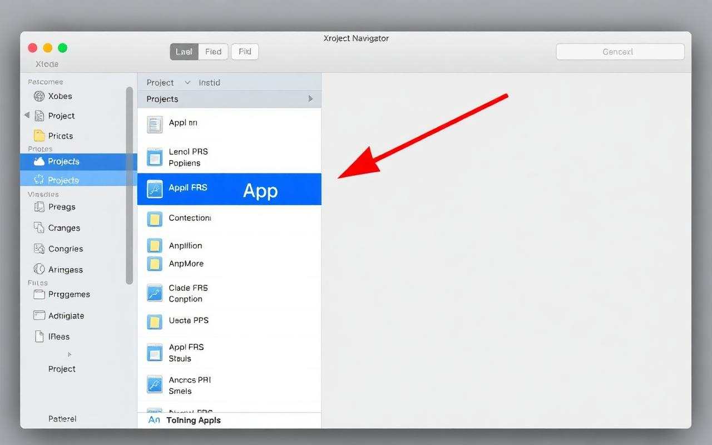
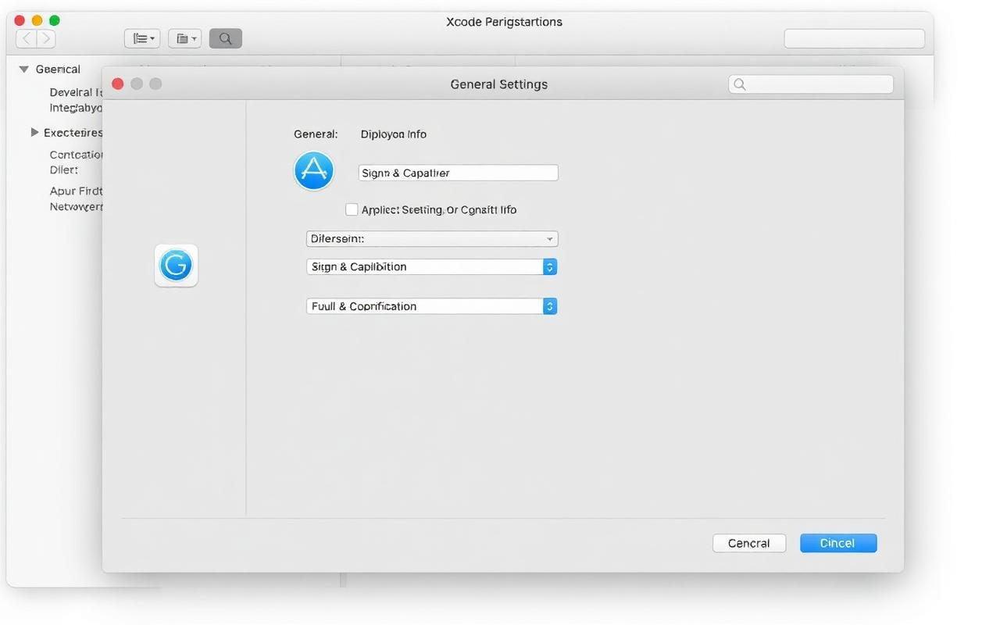
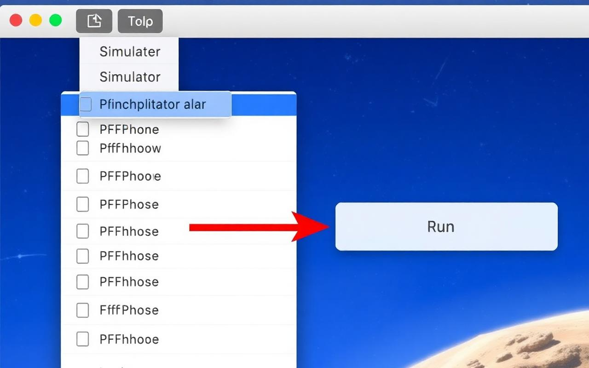

# 🍎 Complete iOS Guide: Converting FlowerExpress Web App to Mobile & Publishing on Apple App Store

## 📋 Table of Contents

1. [Introduction & Overview](#introduction--overview)
2. [Prerequisites & Requirements](#prerequisites--requirements)
3. [Part 1: Setting Up Your Mac Development Environment](#part-1-setting-up-your-mac-development-environment)
4. [Part 2: Apple Developer Account Setup](#part-2-apple-developer-account-setup)
5. [Part 3: Downloading & Preparing Your Code](#part-3-downloading--preparing-your-code)
6. [Part 4: Converting Web App to iOS App](#part-4-converting-web-app-to-ios-app)
7. [Part 5: Xcode Project Configuration](#part-5-xcode-project-configuration)
8. [Part 6: App Icons & Launch Screen](#part-6-app-icons--launch-screen)
9. [Part 7: Testing Your App](#part-7-testing-your-app)
10. [Part 8: Creating Distribution Certificate & Provisioning Profile](#part-8-creating-distribution-certificate--provisioning-profile)
11. [Part 9: Archiving & Uploading to App Store Connect](#part-9-archiving--uploading-to-app-store-connect)
12. [Part 10: App Store Connect Configuration](#part-10-app-store-connect-configuration)
13. [Part 11: Store Listing & Screenshots](#part-11-store-listing--screenshots)
14. [Part 12: App Review & Submission](#part-12-app-review--submission)
15. [Part 13: Post-Publishing Management](#part-13-post-publishing-management)
16. [Part 14: Updating Your App](#part-14-updating-your-app)
17. [Troubleshooting Guide](#troubleshooting-guide)
18. [Quick Reference Checklist](#quick-reference-checklist)

---

## Introduction & Overview

### What This Guide Covers

This guide walks you through **every step** of converting your FlowerExpress web application into an iOS mobile app and publishing it on the Apple App Store.

### ⚠️ Important: Mac Required

**Unlike Android development, iOS development REQUIRES a Mac computer.** You cannot build iOS apps on Windows or Linux.

### What We'll Achieve

By the end of this guide, you will have:
- ✅ A fully functional iOS app on your iPhone
- ✅ Your app published on the Apple App Store
- ✅ Knowledge to update and maintain your app

### Timeline Expectations

| Phase | Duration |
|-------|----------|
| Development Setup | 2-3 hours |
| Apple Developer Account | 24-48 hours (approval) |
| Xcode Configuration | 1-2 hours |
| App Store Connect Setup | 1-2 hours |
| Apple Review | 1-7 days (avg 24-48 hours) |
| **Total** | **2-4 days (excluding approval times)** |

### Cost Overview

| Item | Cost | Notes |
|------|------|-------|
| Apple Developer Program | $99/year | Required for App Store publishing |
| Mac Computer | Varies | Required for development |
| iPhone (optional) | Varies | Can use Simulator instead |

---

## Prerequisites & Requirements

### Hardware Requirements

| Requirement | Details |
|-------------|---------|
| **Mac Computer** | MacBook, iMac, Mac Mini, or Mac Studio |
| macOS Version | macOS Monterey (12.0) or later recommended |
| Storage | 50 GB free space minimum |
| RAM | 8 GB minimum, 16 GB recommended |

### Software Requirements

| Software | Version | Purpose |
|----------|---------|---------|
| Xcode | 15.0 or later | iOS development IDE |
| Node.js | 18.0 or later | Build tools |
| Git | Latest | Version control |
| CocoaPods | Latest | iOS dependency manager |

### Accounts Required

1. **Apple ID** - [appleid.apple.com](https://appleid.apple.com)
2. **Apple Developer Account** - [developer.apple.com](https://developer.apple.com) ($99/year)
3. **GitHub Account** - [github.com](https://github.com) (Free)

---

## Part 1: Setting Up Your Mac Development Environment

### Step 1.1: Install Xcode

**What is Xcode?** Apple's official development environment for building iOS, macOS, watchOS, and tvOS apps.

1. **Open the Mac App Store**:
   - Click the Apple menu () → **App Store**
   - Or press `Cmd + Space`, type "App Store"

2. **Search for Xcode**:
   - In the search bar, type "Xcode"
   - Click on **Xcode** by Apple

3. **Download and Install**:
   - Click **"Get"** then **"Install"**
   - Xcode is large (~12 GB) - this may take 30-60 minutes
   - Enter your Mac password when prompted

4. **First Launch**:
   - Open Xcode from Applications folder
   - Click **"Agree"** to accept license agreements
   - Wait for additional components to install (5-10 minutes)
   - When prompted, install **iOS Simulator**

5. **Verify Installation**:
   - Open Terminal (`Cmd + Space`, type "Terminal")
   - Run: `xcode-select --version`
   - Should show version number

### Step 1.2: Install Xcode Command Line Tools

```bash
xcode-select --install
```

Click **"Install"** when prompted, wait for completion.

### Step 1.3: Install Node.js

1. **Download from nodejs.org**:
   - Go to [nodejs.org](https://nodejs.org/)
   - Download **LTS version** for macOS

2. **Install**:
   - Open the downloaded `.pkg` file
   - Follow installation prompts

3. **Verify**:
   ```bash
   node --version    # Should show v18.x.x or higher
   npm --version     # Should show 9.x.x or higher
   ```

### Step 1.4: Install Git

Git usually comes with Xcode Command Line Tools, but verify:

```bash
git --version
```

If not installed:
```bash
xcode-select --install
```

### Step 1.5: Install CocoaPods

**What is CocoaPods?** A dependency manager for iOS projects, similar to npm for JavaScript.

```bash
sudo gem install cocoapods
```

Enter your Mac password when prompted.

Verify:
```bash
pod --version
```

---

## Part 2: Apple Developer Account Setup

### Step 2.1: Create Apple ID (If Needed)

1. Go to [appleid.apple.com](https://appleid.apple.com)
2. Click **"Create Your Apple ID"**
3. Fill in required information
4. Verify email and phone number

### Step 2.2: Enroll in Apple Developer Program

⚠️ **This costs $99/year and is REQUIRED for App Store publishing**

1. **Go to** [developer.apple.com/programs/enroll](https://developer.apple.com/programs/enroll)

2. **Sign in** with your Apple ID

3. **Choose Account Type**:
   - **Individual**: For personal developers
   - **Organization**: For businesses (requires D-U-N-S number)

4. **Complete Enrollment**:
   - Fill in personal/business information
   - Accept Developer Agreement
   - Pay $99 annual fee

5. **Wait for Approval**:
   - Individual accounts: Usually approved within 24 hours
   - Organization accounts: May take 1-2 weeks (D-U-N-S verification)
   - You'll receive email when approved

### Step 2.3: Verify Enrollment

1. Go to [developer.apple.com](https://developer.apple.com)
2. Sign in
3. You should see **"Account"** and **"Certificates, Identifiers & Profiles"**

---

## Part 3: Downloading & Preparing Your Code

### Step 3.1: Export Code from Lovable to GitHub

1. **In your Lovable project**:
   - Click the **GitHub icon** in the top-right
   - Click **"Export to GitHub"**
   - Connect GitHub account if needed
   - Choose **"Create new repository"**
   - Name: `flowerexpress-app`
   - Click **"Export"**

### Step 3.2: Clone Repository

```bash
# Open Terminal
cd ~/Documents

# Create projects folder
mkdir -p Projects
cd Projects

# Clone your repository
git clone https://github.com/YOUR_USERNAME/flowerexpress-app.git

# Enter project directory
cd flowerexpress-app
```

### Step 3.3: Install Dependencies

```bash
npm install
```

Wait for completion (2-5 minutes).

---

## Part 4: Converting Web App to iOS App

### Step 4.1: Build Web Application

```bash
npm run build
```

This creates optimized files in `dist/` folder.

### Step 4.2: Add iOS Platform

```bash
npx cap add ios
```

This creates the `ios/` folder with Xcode project files.

### Step 4.3: Sync Web App with iOS

```bash
npx cap sync ios
```

This copies your built app into the iOS project and installs iOS dependencies.

### Step 4.4: Open in Xcode

```bash
npx cap open ios
```

Xcode will launch and open your project.

**If Xcode doesn't open automatically**:
1. Open Xcode manually
2. Click **File** → **Open**
3. Navigate to `flowerexpress-app/ios/App`
4. Select `App.xcworkspace` (NOT `.xcodeproj`)
5. Click **Open**

---

## Part 5: Xcode Project Configuration

### Step 5.1: Understanding Xcode Interface



Key areas:
- **Navigator (Left)**: File browser
- **Editor (Center)**: Code/settings editor
- **Inspector (Right)**: Properties panel
- **Toolbar (Top)**: Run, stop, device selection
- **Debug Area (Bottom)**: Console output

### Step 5.2: Select Your Project

1. In the **Navigator** (left panel), click on the **top-level "App"** folder (with blue icon)
2. In the **Editor**, you'll see project settings

### Step 5.3: Configure General Settings



Click on **"App"** under TARGETS (not PROJECT), then select the **"General"** tab:

| Setting | Value |
|---------|-------|
| Display Name | FlowerExpress |
| Bundle Identifier | com.flowerexpress.app |
| Version | 1.0.0 |
| Build | 1 |

### Step 5.4: Configure Signing & Capabilities

1. Click the **"Signing & Capabilities"** tab

2. **Enable Automatic Signing**:
   - Check **"Automatically manage signing"**

3. **Select Team**:
   - Click the **Team** dropdown
   - Select your Apple Developer account
   - If not visible, click **"Add Account..."** and sign in

4. **Verify Bundle Identifier**:
   - Should show `com.flowerexpress.app`
   - If error appears, try a unique identifier like `com.yourname.flowerexpress`

### Step 5.5: Configure Deployment Target

In **General** tab:

| Setting | Recommended Value |
|---------|-------------------|
| Minimum Deployments → iOS | 14.0 |

This determines the oldest iOS version your app supports.

### Step 5.6: Configure Info.plist

1. In Navigator, expand **App** → **App** → find **"Info.plist"**
2. Click to open

Add or verify these entries (right-click to add row):

| Key | Value | Purpose |
|-----|-------|---------|
| Bundle display name | FlowerExpress | App name on home screen |
| Bundle name | FlowerExpress | App name |
| Privacy - Camera Usage Description | FlowerExpress needs camera access to take photos | If using camera |
| Privacy - Photo Library Usage Description | FlowerExpress needs photo access to select images | If using photos |
| App Transport Security Settings → Allow Arbitrary Loads | YES | For development |

---

## Part 6: App Icons & Launch Screen

### Step 6.1: Create App Icon Set

iOS requires multiple icon sizes. We'll use a tool to generate them.

**Option A: Using Online Generator**

1. Go to [appicon.co](https://appicon.co) or [makeappicon.com](https://makeappicon.com)
2. Upload your `src/assets/app-icon-512.png`
3. Download the generated icon set
4. Extract the zip file

**Option B: Using Xcode (Manual)**

Required sizes for App Store:
| Size | Filename |
|------|----------|
| 1024x1024 | AppIcon@1024.png (App Store) |
| 180x180 | AppIcon@3x.png (iPhone) |
| 120x120 | AppIcon@2x.png (iPhone) |
| 167x167 | AppIcon@83.5x2.png (iPad Pro) |
| 152x152 | AppIcon@76x2.png (iPad) |

### Step 6.2: Add Icons to Xcode

1. In Navigator, click **App** → **App** → **Assets**
2. Click on **"AppIcon"**
3. Drag and drop your icons into the appropriate slots:
   - **iPhone App iOS 14-17**: 60pt @ 2x (120x120), @ 3x (180x180)
   - **iPad App iOS 14-17**: 76pt @ 2x (152x152), 83.5pt @ 2x (167x167)
   - **App Store iOS**: 1024pt (1024x1024)

### Step 6.3: Configure Launch Screen

The launch screen (splash screen) shows while your app loads.

1. In Navigator, find **"LaunchScreen.storyboard"**
2. Click to open in Interface Builder
3. You can customize:
   - Background color
   - Logo image
   - Text

**Simple Approach - Color Only**:
1. Click on the **View** in the storyboard
2. In Inspector (right panel), find **Background**
3. Set to your brand color (#ec4899 for FlowerExpress pink)

---

## Part 7: Testing Your App

### Option A: Test on iOS Simulator

1. **Select Simulator**:
   - In Xcode toolbar, click the device dropdown (next to play button)
   - Choose a simulator (e.g., "iPhone 15 Pro")

2. **Run the App**:
   - Click the **▶️ Play** button
   - Wait for Simulator to launch (1-2 minutes first time)
   - Your app should appear!



### Option B: Test on Physical iPhone

1. **Connect iPhone** to Mac with USB cable

2. **Trust the Computer**:
   - On iPhone, tap **"Trust"** when prompted
   - Enter iPhone passcode

3. **Select Your iPhone**:
   - In Xcode device dropdown, select your iPhone name

4. **First Time Setup**:
   - If "Untrusted Developer" error appears:
     - On iPhone: **Settings** → **General** → **VPN & Device Management**
     - Tap your Developer App certificate
     - Tap **"Trust"**

5. **Run the App**:
   - Click ▶️ Play button
   - App installs and launches on your iPhone!

### Testing Checklist

Test these features before submitting:
- [ ] App launches without crashing
- [ ] All screens load correctly
- [ ] Navigation works
- [ ] Buttons and forms function
- [ ] Cart and checkout work
- [ ] Login/signup works
- [ ] Images display properly
- [ ] WhatsApp button opens WhatsApp

---

## Part 8: Creating Distribution Certificate & Provisioning Profile

### Understanding iOS Signing

Apple requires apps to be **signed** to prove:
- You are a verified developer
- The app hasn't been modified
- It's authorized to run on devices

### Step 8.1: Create App ID

1. Go to [developer.apple.com/account](https://developer.apple.com/account)
2. Click **"Certificates, Identifiers & Profiles"**
3. Click **"Identifiers"** in sidebar
4. Click **"+"** button

5. **Register App ID**:
   - Select **"App IDs"** → **Continue**
   - Select **"App"** → **Continue**
   - Description: `FlowerExpress App`
   - Bundle ID: **Explicit** → `com.flowerexpress.app`
   - Scroll down, enable any Capabilities needed
   - Click **Continue** → **Register**

### Step 8.2: Create Distribution Certificate

1. In **Certificates, Identifiers & Profiles**, click **"Certificates"**
2. Click **"+"** button
3. Select **"Apple Distribution"** → **Continue**

4. **Create CSR (Certificate Signing Request)**:
   - On your Mac, open **Keychain Access** (Cmd+Space, search "Keychain Access")
   - Menu: **Keychain Access** → **Certificate Assistant** → **Request a Certificate from a Certificate Authority**
   - Fill in:
     - Email: Your email
     - Common Name: Your name or company
     - Request is: **Saved to disk**
   - Click **Continue**, save the `.certSigningRequest` file

5. **Upload CSR**:
   - Back in browser, click **Choose File**
   - Select your `.certSigningRequest` file
   - Click **Continue**

6. **Download Certificate**:
   - Click **Download**
   - Double-click the downloaded `.cer` file to install in Keychain

### Step 8.3: Create Provisioning Profile

1. In sidebar, click **"Profiles"**
2. Click **"+"** button
3. Select **"App Store Connect"** (under Distribution) → **Continue**
4. Select your App ID (`com.flowerexpress.app`) → **Continue**
5. Select your Distribution Certificate → **Continue**
6. Profile Name: `FlowerExpress Distribution`
7. Click **Generate** → **Download**
8. Double-click to install

### Step 8.4: Configure in Xcode

1. In Xcode, select your project
2. Go to **Signing & Capabilities** tab
3. Uncheck **"Automatically manage signing"**
4. **Signing (Release)**:
   - Provisioning Profile: Select your distribution profile
   - Signing Certificate: Select your distribution certificate

---

## Part 9: Archiving & Uploading to App Store Connect

### Step 9.1: Set Build Configuration

1. In Xcode menu: **Product** → **Scheme** → **Edit Scheme**
2. Select **"Archive"** from left sidebar
3. Set **Build Configuration** to **"Release"**
4. Click **Close**

### Step 9.2: Select "Any iOS Device"

1. In the device dropdown (Xcode toolbar)
2. Select **"Any iOS Device (arm64)"**
   - You cannot archive when a simulator is selected

### Step 9.3: Create Archive

1. In Xcode menu: **Product** → **Archive**
2. Wait for build process (3-10 minutes)
3. When complete, **Organizer** window opens automatically

### Step 9.4: Validate Archive

Before uploading, validate your archive:

1. In Organizer, select your archive
2. Click **"Validate App"**
3. Select your Apple ID
4. Select your team
5. Click **"Validate"**
6. Wait for validation (1-2 minutes)
7. If successful, you'll see "App 'FlowerExpress' successfully validated"

### Step 9.5: Distribute to App Store

1. Click **"Distribute App"**
2. Select **"App Store Connect"** → **Next**
3. Select **"Upload"** → **Next**
4. Options:
   - ☑️ Include bitcode for iOS content
   - ☑️ Upload your app's symbols
   - ☐ Manage Version and Build Number (optional)
5. Click **Next**
6. Select signing certificates (should auto-detect)
7. Click **Upload**
8. Wait for upload (5-10 minutes depending on app size)
9. Success message: "App 'FlowerExpress' successfully uploaded"

---

## Part 10: App Store Connect Configuration

### Step 10.1: Access App Store Connect

1. Go to [appstoreconnect.apple.com](https://appstoreconnect.apple.com)
2. Sign in with your Apple ID

### Step 10.2: Create New App

1. Click **"My Apps"**
2. Click **"+"** → **"New App"**

3. **Fill in App Information**:

| Field | Value |
|-------|-------|
| Platforms | iOS |
| Name | FlowerExpress |
| Primary Language | English (U.S.) |
| Bundle ID | com.flowerexpress.app |
| SKU | flowerexpress001 (unique identifier) |
| User Access | Full Access |

4. Click **Create**

### Step 10.3: App Information

In left sidebar, click **"App Information"**:

| Field | Value |
|-------|-------|
| Name | FlowerExpress |
| Subtitle | Fresh Flower Delivery |
| Primary Category | Shopping |
| Secondary Category | Lifestyle |
| Content Rights | Does not contain, show, or access third-party content |
| Age Rating | 4+ |

---

## Part 11: Store Listing & Screenshots

### Step 11.1: App Privacy

In left sidebar, click **"App Privacy"**:

1. **Privacy Policy URL**:
   ```
   https://ce940b1d-3075-43ef-b4c3-9bce0537c076.lovableproject.com/privacy-policy
   ```

2. **Data Collection**:
   - Click **"Get Started"**
   - Do you collect data? → **Yes**
   
3. **Data Types Collected**:
   | Data Type | Collection | Purpose |
   |-----------|------------|---------|
   | Name | Yes | App Functionality |
   | Email Address | Yes | App Functionality |
   | Phone Number | Yes | App Functionality |
   | Physical Address | Yes | App Functionality |
   | Purchase History | Yes | App Functionality |

4. **Click "Publish"**

### Step 11.2: Prepare Screenshots

**Required Screenshots**:

| Device | Dimensions | Required |
|--------|------------|----------|
| iPhone 6.7" | 1290 x 2796 | Yes |
| iPhone 6.5" | 1242 x 2688 | Yes |
| iPhone 5.5" | 1242 x 2208 | Yes |
| iPad 12.9" | 2048 x 2732 | Required if supports iPad |

**Taking Screenshots from Simulator**:

1. Run app in Simulator
2. Navigate to screen you want to capture
3. Press `Cmd + S` to save screenshot
4. Screenshots saved to Desktop

**Recommended Screenshots**:
1. Home screen / Hero
2. Product categories
3. Product detail
4. Shopping cart
5. Checkout
6. Order confirmation

### Step 11.3: Version Information

In left sidebar, click **"1.0 Prepare for Submission"**:

**App Screenshots**:
- Drag and drop screenshots for each device size

**Promotional Text** (optional, 170 chars):
```
Order fresh flowers delivered to your doorstep. Beautiful bouquets, garlands & seasonal arrangements. Fast delivery! 🌸
```

**Description** (4000 chars max):
```
🌸 FlowerExpress - Your Premium Fresh Flower Delivery Service

Welcome to FlowerExpress! The easiest way to order beautiful, fresh flowers delivered right to your doorstep.

✨ KEY FEATURES:

• Fresh Quality Flowers - Hand-picked, premium flowers delivered fresh
• Wide Selection - Browse spare flowers, tied bouquets, flower garlands, and seasonal arrangements  
• Easy Ordering - Simple, intuitive app interface for quick orders
• Next-Day Delivery - Fast and reliable delivery service
• Secure Payments - Safe and encrypted payment processing
• Order Tracking - Keep track of all your flower deliveries
• Customer Support - Direct WhatsApp support for instant help
• Multi-language Support - Available in English and Tamil

🌺 FLOWER CATEGORIES:

• Spare Flowers - Individual stems for DIY arrangements
• Tied Flowers - Pre-arranged bouquets ready to gift
• Flower Garlands - Traditional garlands for special occasions
• Seasonal Flowers - Special arrangements for festivals and holidays

💐 WHY CHOOSE FLOWEREXPRESS?

• Quality Guaranteed - Only the freshest flowers from trusted suppliers
• Reliable Service - On-time delivery you can count on
• Easy Returns - Hassle-free customer service
• Secure Shopping - Your data is protected with industry-standard encryption

Perfect for birthdays, anniversaries, weddings, celebrations, religious ceremonies, corporate events, and everyday gifting.

Download FlowerExpress today and experience the joy of fresh flowers! 🌹
```

**Keywords** (100 chars, comma-separated):
```
flowers,flower delivery,bouquets,garlands,fresh flowers,gift flowers,wedding flowers,flower shop
```

**Support URL**:
```
https://ce940b1d-3075-43ef-b4c3-9bce0537c076.lovableproject.com
```

**Marketing URL** (optional):
```
https://ce940b1d-3075-43ef-b4c3-9bce0537c076.lovableproject.com
```

**Version Release**:
- Select **"Automatically release this version"** or **"Manually release"**

### Step 11.4: App Review Information

| Field | Value |
|-------|-------|
| First Name | Your first name |
| Last Name | Your last name |
| Phone Number | Your phone |
| Email | Your email |
| Notes | None required for basic app |

**Demo Account** (if login required):
- Username: demo@test.com
- Password: demopassword123

---

## Part 12: App Review & Submission

### Step 12.1: Build Selection

1. In **"Build"** section, click **"Select a build"**
2. Choose the build you uploaded earlier
3. Click **"Done"**

### Step 12.2: Final Review

Check all sections show ✓ (green checkmark):
- [ ] App Information
- [ ] Pricing and Availability
- [ ] App Privacy
- [ ] Version Information
- [ ] Screenshots
- [ ] Build

### Step 12.3: Submit for Review

1. Click **"Add for Review"** (top right)
2. Review all information
3. Click **"Submit to App Review"**
4. Your app is now submitted! 🎉

### App Review Timeline

| Status | Meaning |
|--------|---------|
| Waiting for Review | In queue |
| In Review | Apple is reviewing |
| Pending Developer Release | Approved, waiting for you to release |
| Ready for Sale | LIVE on App Store! 🎉 |
| Rejected | Issues found (see resolution) |

**Typical Timeline**:
- Most apps: 24-48 hours
- First submission: May take up to 7 days
- Updates: Usually faster

### If Rejected

1. Read the rejection reason in App Store Connect
2. Check email for details from Apple
3. Common rejection reasons:
   - Crashes or bugs
   - Incomplete app (placeholder content)
   - Missing privacy policy
   - Guideline violations
   - Payment issues (must use Apple Pay for digital goods)

4. Fix issues and resubmit

---

## Part 13: Post-Publishing Management

### Finding Your Published App

1. **Get App Store URL**:
   - In App Store Connect, click your app
   - Go to **"App Information"**
   - Find **"Apple ID"** (e.g., 1234567890)
   - URL: `https://apps.apple.com/app/id1234567890`

2. **Test on iPhone**:
   - Open App Store
   - Search "FlowerExpress"
   - Your app should appear!

### Monitoring Performance

**App Analytics** (in App Store Connect):
- Downloads and updates
- Sessions and active devices
- Retention rates
- Crashes

**Sales and Trends**:
- Revenue (if applicable)
- In-app purchases
- Subscriptions

### Responding to Reviews

1. Go to **App Store Connect** → **My Apps** → Your App
2. Click **"Ratings and Reviews"**
3. Click **"Customer Reviews"**
4. Click on a review → **"Reply"**

---

## Part 14: Updating Your App

### When to Update

- 🐛 Bug fixes
- ✨ New features
- 🔒 Security updates
- 📱 iOS compatibility
- 📈 Performance improvements

### Update Process

#### Step 1: Make Code Changes

```bash
cd ~/Documents/Projects/flowerexpress-app
git pull origin main
```

#### Step 2: Update Version Numbers

In Xcode, select project → **General** tab:

| Field | Current | New |
|-------|---------|-----|
| Version | 1.0.0 | 1.1.0 |
| Build | 1 | 2 |

**Version Rules**:
- Version: Can stay same for bug fixes, increment for features
- Build: MUST increase for every upload

#### Step 3: Rebuild and Sync

```bash
npm run build
npx cap sync ios
```

#### Step 4: Archive and Upload

1. In Xcode: **Product** → **Archive**
2. Validate, then **Distribute App** → **Upload**

#### Step 5: Submit New Version

1. In App Store Connect, click your app
2. Click **"+ Version or Platform"**
3. Enter new version number (e.g., 1.1.0)
4. Add new screenshots if needed
5. Update **"What's New"** text
6. Select new build
7. Submit for Review

---

## Troubleshooting Guide

### Build Errors

#### "Signing requires a development team"
```
Solution:
1. Select project in Navigator
2. Signing & Capabilities tab
3. Select your Team from dropdown
4. If not visible, add account: Xcode → Settings → Accounts
```

#### "No provisioning profile found"
```
Solution:
1. Check developer.apple.com for valid profile
2. Download and double-click to install
3. In Xcode, select profile manually in Signing
```

#### "Code signing error"
```
Solution:
1. Revoke old certificates in developer.apple.com
2. Create new certificate
3. Create new provisioning profile
4. Download and install both
```

### Upload Errors

#### "Invalid Binary"
```
Solution:
1. Ensure all icons are present
2. Check Info.plist for required entries
3. Verify bundle identifier matches App Store Connect
```

#### "Build number already used"
```
Solution:
1. Increment Build number in Xcode
2. Archive again
3. Upload new build
```

### Runtime Errors

#### White screen on launch
```
Solution:
1. Verify npm run build completed
2. Run npx cap sync ios
3. Check capacitor.config.ts URL
4. Clean build: Product → Clean Build Folder
```

#### "Untrusted Developer"
```
Solution (on iPhone):
1. Settings → General → VPN & Device Management
2. Tap your developer certificate
3. Tap "Trust"
```

---

## Quick Reference Checklist

### Development Setup
- [ ] Mac computer available
- [ ] Xcode installed
- [ ] Node.js installed
- [ ] CocoaPods installed
- [ ] Apple Developer account enrolled ($99)

### Project Setup
- [ ] Code exported to GitHub
- [ ] Repository cloned locally
- [ ] `npm install` completed
- [ ] `npm run build` successful
- [ ] `npx cap add ios` completed
- [ ] `npx cap sync ios` completed
- [ ] Project opens in Xcode

### Xcode Configuration
- [ ] Display name set
- [ ] Bundle identifier configured
- [ ] Version and build numbers set
- [ ] Signing team selected
- [ ] App icons added
- [ ] Launch screen configured

### Certificates & Profiles
- [ ] App ID registered
- [ ] Distribution certificate created
- [ ] Provisioning profile created
- [ ] Certificate installed in Keychain
- [ ] Profile installed

### App Store Connect
- [ ] App created
- [ ] App information complete
- [ ] Privacy policy URL added
- [ ] Data privacy declarations done
- [ ] Screenshots uploaded (all sizes)
- [ ] Description and keywords added
- [ ] Build uploaded and selected

### Submission
- [ ] All sections show green checkmarks
- [ ] App submitted for review
- [ ] Review approved
- [ ] App is live! 🎉

---

## Additional Resources

| Resource | Link |
|----------|------|
| Apple Developer Docs | [developer.apple.com/documentation](https://developer.apple.com/documentation) |
| Capacitor iOS Docs | [capacitorjs.com/docs/ios](https://capacitorjs.com/docs/ios) |
| App Store Guidelines | [developer.apple.com/app-store/review/guidelines](https://developer.apple.com/app-store/review/guidelines) |
| Human Interface Guidelines | [developer.apple.com/design/human-interface-guidelines](https://developer.apple.com/design/human-interface-guidelines) |
| Lovable Docs | [docs.lovable.dev](https://docs.lovable.dev) |

---

## 🎉 Congratulations!

You've successfully converted your web app to an iOS app and published it on the Apple App Store!

**Remember**:
- Keep your certificates and profiles backed up
- Renew your Apple Developer membership annually ($99)
- Update regularly to maintain user engagement
- Respond to user reviews professionally
- Monitor crash reports and fix issues promptly
- Test on real devices before submitting updates

Happy app publishing! 🌸📱🍎
